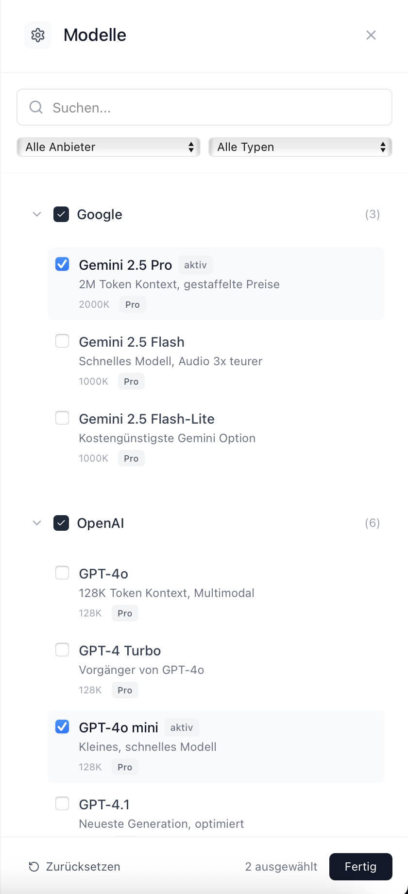

# 🤖 AI Token Calculator

<div align="center">


**Berechne Token-Kosten für 50+ KI-Modelle in Echtzeit**

[Demo](https://aitokencalculator.com) • [Dokumentation](./CLAUDE.md) • [Issues](https://github.com/nicremo/aitokencalculator/issues)

</div>

## 🌟 Features

- ✨ **50+ KI-Modelle** von OpenAI, Anthropic, Google, Meta und mehr
- 🌍 **13 Sprachen** - Vollständig internationalisiert
- 💰 **Kostenberechnung** - Sieh die API-Kosten bevor du sendest
- 📊 **Live-Updates** - Token-Berechnung während der Eingabe
- 📁 **Datei-Support** - Ziehe Textdateien per Drag & Drop rein
- 🎨 **Modernes UI** - Responsive Design mit smooth animations
- 💾 **Export** - Speichere deine Analysen als CSV
- 🔒 **Privatsphäre** - Alles läuft lokal in deinem Browser

## 📸 Screenshots

<div align="center">
  
  <p><em>Analysiere deinen Text für mehrere KI-Modelle gleichzeitig</em></p>
</div>

<div align="center">
  
  <p><em>Wähle aus 50+ KI-Modellen von 14 verschiedenen Anbietern</em></p>
</div>

## 🚀 Schnellstart

### Voraussetzungen

- Node.js 18 oder höher
- npm oder yarn

### Installation

```bash
# Repository klonen
git clone https://github.com/nicremo/aitokencalculator.git
cd aitokencalculator

# Dependencies installieren
npm install

# Entwicklungsserver starten
npm run dev
```

Öffne [http://localhost:3000](http://localhost:3000) in deinem Browser.

### Production Build

```bash
# Build erstellen
npm run build

# Production Server starten
npm start
```

## 🛠️ Technologie-Stack

- **Framework:** [Next.js 15](https://nextjs.org/) mit App Router
- **Sprache:** [TypeScript](https://www.typescriptlang.org/)
- **Styling:** [Tailwind CSS](https://tailwindcss.com/)
- **Icons:** [Lucide React](https://lucide.dev/)
- **Internationalisierung:** [next-intl](https://next-intl-docs.vercel.app/)
- **File Upload:** [react-dropzone](https://react-dropzone.js.org/)

## 📖 Verwendung

### Text analysieren

1. Gib deinen Text in das Eingabefeld ein oder lade eine Datei hoch
2. Die Token-Anzahl wird automatisch für alle aktiven Modelle berechnet
3. Sieh dir die Kosten und den Status (passt/knapp/zu groß) an
4. Exportiere die Ergebnisse als CSV für weitere Analysen

### Modelle anpassen

1. Klicke auf "Modelle anpassen" in der oberen rechten Ecke
2. Suche nach Modellen oder filtere nach Anbieter
3. Aktiviere oder deaktiviere Modelle nach Bedarf
4. Deine Auswahl wird automatisch gespeichert

## 🌍 Unterstützte Sprachen

- 🇩🇪 Deutsch
- 🇬🇧 Englisch
- 🇪🇸 Spanisch
- 🇫🇷 Französisch
- 🇮🇹 Italienisch
- 🇵🇱 Polnisch
- 🇳🇱 Niederländisch
- 🇵🇹 Portugiesisch
- 🇨🇿 Tschechisch
- 🇸🇪 Schwedisch
- 🇩🇰 Dänisch
- 🇳🇴 Norwegisch
- 🇫🇮 Finnisch

## 🤝 Mitwirken

Wir freuen uns über Beiträge! Siehe [CONTRIBUTING.md](./CONTRIBUTING.md) für Details.

### Entwicklung

```bash
# Linting
npm run lint

# Type-Checking
npm run type-check

# Tests ausführen
npm test
```

## 📊 Unterstützte KI-Modelle

<details>
<summary>Alle 50+ Modelle anzeigen</summary>

### OpenAI
- GPT-4o, GPT-4.1 (und mini/nano Varianten)
- GPT-4 Turbo
- GPT-3.5 Turbo

### Anthropic
- Claude 4 Opus & Sonnet
- Claude 3.5 Haiku
- Claude 3 Serie

### Google
- Gemini 2.5 Pro
- Gemini 2.5 Flash & Flash-Lite

### Meta
- Llama 3.1 (405B, 70B, 8B)

### Und viele mehr...
Mistral AI, Cohere, AI21, DeepSeek, Alibaba Cloud, und weitere!

</details>

## 📝 Lizenz

Dieses Projekt ist unter der MIT-Lizenz lizenziert - siehe [LICENSE](./LICENSE) für Details.

## 👨‍💻 Autor

**Fabian Bitzer**
- Website: [fabian-bitzer.de](https://fabian-bitzer.de/)
- GitHub: [@nicremo](https://github.com/nicremo)
- Email: kontakt@bitzer-fabian.de

## 🙏 Danksagungen

- Alle Mitwirkenden, die dieses Projekt möglich gemacht haben
- Die Open-Source-Community für die großartigen Tools und Libraries
- Die KI-Anbieter für ihre Dokumentation und APIs

## 📞 Support

- **Issues:** [GitHub Issues](https://github.com/nicremo/aitokencalculator/issues)
- **Diskussionen:** [GitHub Discussions](https://github.com/nicremo/aitokencalculator/discussions)
- **Email:** kontakt@bitzer-fabian.de

---

<div align="center">
  <p>Mit ❤️ entwickelt von <a href="https://fabian-bitzer.de/">Fabian Bitzer</a> für die KI-Community</p>
  <p>
    <a href="#top">Nach oben ↑</a>
  </p>
</div>