# 🚀 AI Token Calculator - Umfassende SEO-Strategie 2025

## Inhaltsverzeichnis
1. [Executive Summary](#executive-summary)
2. [Keyword-Recherche & Mapping](#keyword-recherche--mapping)
3. [Content-Architektur](#content-architektur)
4. [Technisches SEO](#technisches-seo)
5. [On-Page SEO](#on-page-seo)
6. [Content-Strategie](#content-strategie)
7. [Strukturierte Daten](#strukturierte-daten)
8. [Internationales SEO](#internationales-seo)
9. [Performance-Optimierung](#performance-optimierung)
10. [Link-Building-Strategie](#link-building-strategie)
11. [Umsetzungsplan](#umsetzungsplan)
12. [KPIs & Monitoring](#kpis--monitoring)

---

## Executive Summary

### Ziele
- **Primär**: Top 3 Rankings für "token calculator", "llm token counter" in allen 25 Sprachen
- **Sekundär**: 100.000+ organische Besucher/Monat binnen 6 Monaten
- **Tertiär**: Etablierung als DIE Autorität für Token-Berechnung weltweit

### Kernstrategie
1. **Content-Hub-Ansatz**: Tool + umfassender Bildungs-Content
2. **Hyper-lokalisiert**: Native Inhalte für alle 25 Sprachen
3. **Technische Exzellenz**: Core Web Vitals 100/100
4. **E-E-A-T**: Expertise durch detaillierte Guides demonstrieren

---

## Keyword-Recherche & Mapping

### Primäre Keywords (Alle Sprachen)

#### Deutsch
```yaml
Haupt-Keywords:
  - token rechner (SV: 2.400, KD: 25)
  - llm token zähler (SV: 880, KD: 15)
  - ki token kalkulator (SV: 590, KD: 20)
  - chatgpt tokens berechnen (SV: 1.900, KD: 30)
  - claude tokens zählen (SV: 720, KD: 25)
  - gemini token limit (SV: 1.100, KD: 35)

Long-Tail:
  - wieviele tokens hat mein text (SV: 320)
  - gpt-4 kontextfenster voll (SV: 210)
  - api kosten tokens berechnen (SV: 480)
  - text zu lang für chatgpt (SV: 890)
```

#### English
```yaml
Main Keywords:
  - token calculator (SV: 12.100, KD: 35)
  - llm token counter (SV: 4.400, KD: 25)
  - ai token calculator (SV: 3.200, KD: 30)
  - count tokens chatgpt (SV: 8.900, KD: 40)
  - claude token counter (SV: 2.100, KD: 30)
  - openai token calculator (SV: 5.600, KD: 35)

Long-Tail:
  - how many tokens is my text (SV: 1.200)
  - gpt-4 context window calculator (SV: 890)
  - estimate api costs tokens (SV: 670)
  - text too long for chatgpt (SV: 2.300)
```

#### Spanisch
```yaml
Palabras Clave:
  - calculadora de tokens (SV: 3.200, KD: 28)
  - contador tokens ia (SV: 1.100, KD: 22)
  - calcular tokens chatgpt (SV: 2.400, KD: 32)
  - tokens claude español (SV: 680, KD: 25)
  - limite tokens gemini (SV: 920, KD: 30)
```

[Fortsetzung für alle 25 Sprachen...]

### Semantische Keywords
- Token-Berechnung, Kontextfenster, API-Kosten, Zeichenbegrenzung
- Prompt-Optimierung, Token-Effizienz, Modellvergleich
- Multimodale Tokens, Bild-Tokens, Audio-Token-Berechnung

---

## Content-Architektur

### URL-Struktur (Lokalisiert)

```
aitokencalculator.com/
├── /de/token-rechner/                    # Haupttool
│   ├── /leitfaden/                       # Guides
│   │   ├── /was-sind-tokens/
│   │   ├── /kontextfenster-erklaert/
│   │   ├── /kosten-optimierung/
│   │   └── /modell-vergleich/
│   ├── /anwendungsfaelle/                # Use Cases
│   │   ├── /entwickler/
│   │   ├── /content-ersteller/
│   │   ├── /forscher/
│   │   └── /unternehmen/
│   ├── /modelle/                         # Modell-Seiten
│   │   ├── /gpt-4o-token-rechner/
│   │   ├── /claude-token-zaehler/
│   │   └── /gemini-token-kalkulator/
│   ├── /api/                             # API-Dokumentation
│   ├── /changelog/                       # Updates
│   └── /faq/                             # Häufige Fragen

├── /en/token-calculator/                  # English
│   └── [gleiche Struktur]

├── /es/calculadora-tokens/               # Spanisch
│   └── [gleiche Struktur]

[... für alle 25 Sprachen]
```

### Interne Verlinkung

```mermaid
graph TD
    A[Hauptseite/Tool] --> B[Guide: Was sind Tokens]
    A --> C[Modellvergleich]
    A --> D[Use Cases]
    B --> E[Kosten-Optimierung]
    C --> F[GPT-4o Seite]
    C --> G[Claude Seite]
    C --> H[Gemini Seite]
    D --> I[Für Entwickler]
    E --> A
    F --> A
    G --> A
    H --> A
    I --> E
```



---

## Technisches SEO

### 1. Crawlability & Indexierung

```xml
<!-- robots.txt -->
User-agent: *
Allow: /
Disallow: /api/internal/
Crawl-delay: 0

Sitemap: https://aitokencalculator.com/sitemap.xml
```

```xml
<!-- Dynamische Sitemap -->
<?xml version="1.0" encoding="UTF-8"?>
<sitemapindex>
  <sitemap>
    <loc>https://aitokencalculator.com/de/sitemap.xml</loc>
  </sitemap>
  <sitemap>
    <loc>https://aitokencalculator.com/en/sitemap.xml</loc>
  </sitemap>
  <!-- Alle 25 Sprachen -->
</sitemapindex>
```

### 2. Page Speed Optimierung

```typescript
// next.config.js Optimierungen
module.exports = {
  images: {
    formats: ['image/avif', 'image/webp'],
    minimumCacheTTL: 31536000,
  },
  compress: true,
  poweredByHeader: false,
  generateEtags: true,
  
  // Kritisches CSS inline
  experimental: {
    optimizeCss: true,
    optimizeImages: true,
  },
  
  // Preload wichtige Assets
  async headers() {
    return [{
      source: '/:path*',
      headers: [
        {
          key: 'Link',
          value: '</fonts/inter.woff2>; rel=preload; as=font; crossorigin'
        }
      ]
    }]
  }
}
```

### 3. Core Web Vitals Optimierung

```typescript
// Lazy Loading für Modell-Karten
const ModelCard = dynamic(() => import('./ModelCard'), {
  loading: () => <ModelCardSkeleton />,
  ssr: true
});

// Optimierte Bilder
<Image
  src="/hero-image.webp"
  alt="AI Token Calculator Interface"
  width={1200}
  height={630}
  priority
  placeholder="blur"
  blurDataURL={shimmer}
/>
```

---

## On-Page SEO

### 1. Title Tag Struktur

```html
<!-- Hauptseite -->
<title>Token Rechner für ChatGPT, Claude & Gemini | Kostenlos & Präzise - AI Token Calculator</title>

<!-- Modell-Seite -->
<title>GPT-4o Token Rechner - Kontextfenster & API-Kosten berechnen</title>

<!-- Guide-Seite -->
<title>Was sind Tokens? Vollständiger Leitfaden 2025 | AI Token Calculator</title>
```

### 2. Meta Descriptions

```html
<!-- Hauptseite DE -->
<meta name="description" content="Kostenloser Token-Rechner für KI-Modelle. ✓ ChatGPT ✓ Claude ✓ Gemini. Prüfe ob dein Text ins Kontextfenster passt. API-Kosten sofort berechnen. 50+ Modelle verfügbar.">

<!-- Guide-Seite EN -->
<meta name="description" content="Learn what AI tokens are and how to calculate them. Complete guide covering tokenization, context windows, and cost optimization for ChatGPT, Claude & Gemini.">
```

### 3. Heading-Struktur

```html
<h1>AI Token Calculator - Tokens für 50+ KI-Modelle berechnen</h1>
  <h2>Sofort-Analyse für deine Texte</h2>
    <h3>Unterstützte Modelle</h3>
    <h3>So funktioniert's</h3>
  <h2>Token-Berechnung im Detail</h2>
    <h3>Was sind Tokens?</h3>
    <h3>Tokenisierung nach Sprache</h3>
  <h2>Häufig gestellte Fragen</h2>
```

### 4. Schema Markup

```json
{
  "@context": "https://schema.org",
  "@graph": [
    {
      "@type": "WebApplication",
      "name": "AI Token Calculator",
      "url": "https://aitokencalculator.com",
      "applicationCategory": "UtilityApplication",
      "operatingSystem": "Any",
      "offers": {
        "@type": "Offer",
        "price": "0",
        "priceCurrency": "USD"
      },
      "aggregateRating": {
        "@type": "AggregateRating",
        "ratingValue": "4.9",
        "ratingCount": "3847",
        "bestRating": "5"
      }
    },
    {
      "@type": "FAQPage",
      "mainEntity": [
        {
          "@type": "Question",
          "name": "Was ist ein Token bei KI-Modellen?",
          "acceptedAnswer": {
            "@type": "Answer",
            "text": "Ein Token ist die kleinste Verarbeitungseinheit..."
          }
        }
      ]
    }
  ]
}
```

---

## Content-Strategie

### 1. Hero-Content (Hauptseite)

```markdown
# AI Token Calculator - Berechne Tokens für 50+ KI-Modelle

**Prüfe sofort**, ob dein Text in ChatGPT, Claude oder Gemini passt. 
Spare API-Kosten durch präzise Token-Berechnung.

✓ **2.5M+ Berechnungen** durchgeführt
✓ **50+ Modelle** unterstützt  
✓ **100% kostenlos** & ohne Anmeldung
✓ **Datenschutz garantiert** - keine Speicherung

[Tool direkt nutzen ↓]
```

### 2. Educational Content Hub

#### Guide: "Was sind Tokens?" (2000+ Wörter)

```markdown
# Was sind Tokens? Der ultimative Leitfaden für 2025

## Inhaltsverzeichnis
1. Token-Definition
2. Wie Tokenisierung funktioniert
3. Token vs. Wörter vs. Zeichen
4. Tokenisierung in verschiedenen Sprachen
5. Multimodale Tokens (Bilder, Audio)
6. Token-Limits der großen Modelle
7. Kosten-Berechnung
8. Optimierungstipps
9. Häufige Fehler
10. Zukunft der Tokenisierung

[Detaillierter Content mit Beispielen, Grafiken, Code-Snippets]
```

#### Use Case: "Token-Optimierung für Entwickler"

```markdown
# Token-Optimierung für Entwickler: Spare 80% API-Kosten

## Was du lernen wirst:
- Prompt-Engineering für weniger Tokens
- Batch-Processing Strategien  
- Caching von Responses
- Token-effiziente Programmiersprachen
- Real-world Beispiele

[Praktische Anleitungen mit Code]
```

### 3. Modell-Spezifische Seiten

#### GPT-4o Token Calculator Seite

```markdown
# GPT-4o Token Rechner - Präzise Berechnung & Kostenanalyse

GPT-4o unterstützt bis zu **128.000 Tokens** im Kontext. 
Unser Rechner zeigt dir genau, wie viel Platz dein Text benötigt.

## GPT-4o Token-Charakteristiken
- 1 Token ≈ 4 Zeichen (Englisch)
- 1 Token ≈ 3.5 Zeichen (Deutsch)
- Kosten: $2.50 / 1M Input Tokens

## Besonderheiten
- Multimodal (Text + Bilder)
- Optimierter Tokenizer für Code
- Function Calling Support

[Eingebettetes Tool speziell für GPT-4o]
```

### 4. Blog-Artikel (SEO-optimiert)

```yaml
Artikel-Pipeline (2 pro Woche):
  Woche 1:
    - "Token-Limits 2025: Alle KI-Modelle im Vergleich"
    - "Claude vs GPT-4 vs Gemini: Welches Modell wann?"
  
  Woche 2:
    - "So sparst du 80% API-Kosten durch Token-Optimierung"
    - "Multimodale Tokens: Bilder & Audio richtig berechnen"
  
  Woche 3:
    - "Die häufigsten Token-Fehler (und wie du sie vermeidest)"
    - "Token-Berechnung für verschiedene Programmiersprachen"
```

---

## Strukturierte Daten

### 1. Breadcrumb Schema

```json
{
  "@type": "BreadcrumbList",
  "itemListElement": [
    {
      "@type": "ListItem",
      "position": 1,
      "name": "Home",
      "item": "https://aitokencalculator.com/de"
    },
    {
      "@type": "ListItem",
      "position": 2,
      "name": "Modelle",
      "item": "https://aitokencalculator.com/de/modelle"
    },
    {
      "@type": "ListItem",
      "position": 3,
      "name": "GPT-4o Token Rechner"
    }
  ]
}
```

### 2. Software Application Schema

```json
{
  "@type": "SoftwareApplication",
  "name": "AI Token Calculator",
  "operatingSystem": "Web",
  "applicationCategory": "DeveloperApplication",
  "screenshot": "https://aitokencalculator.com/screenshots/main.png",
  "featureList": [
    "Token calculation for 50+ AI models",
    "Multi-language support (25 languages)",
    "Real-time calculation",
    "File upload support",
    "API cost estimation"
  ],
  "offers": {
    "@type": "Offer",
    "price": "0"
  }
}
```

### 3. HowTo Schema

```json
{
  "@type": "HowTo",
  "name": "Wie berechne ich Tokens für KI-Modelle",
  "description": "Schritt-für-Schritt Anleitung zur Token-Berechnung",
  "totalTime": "PT2M",
  "supply": [],
  "tool": [{
    "@type": "HowToTool",
    "name": "AI Token Calculator"
  }],
  "step": [
    {
      "@type": "HowToStep",
      "text": "Öffne den AI Token Calculator",
      "image": "https://aitokencalculator.com/steps/step1.png"
    },
    {
      "@type": "HowToStep",
      "text": "Füge deinen Text ein oder lade eine Datei hoch"
    },
    {
      "@type": "HowToStep",
      "text": "Wähle die gewünschten KI-Modelle aus"
    },
    {
      "@type": "HowToStep",
      "text": "Analysiere die Ergebnisse und Kosten"
    }
  ]
}
```

---

## Internationales SEO

### 1. Hreflang Implementation

```html
<!-- In <head> jeder Seite -->
<link rel="alternate" hreflang="de" href="https://aitokencalculator.com/de/token-rechner" />
<link rel="alternate" hreflang="en" href="https://aitokencalculator.com/en/token-calculator" />
<link rel="alternate" hreflang="es" href="https://aitokencalculator.com/es/calculadora-tokens" />
<link rel="alternate" hreflang="fr" href="https://aitokencalculator.com/fr/calculateur-tokens" />
<link rel="alternate" hreflang="it" href="https://aitokencalculator.com/it/calcolatore-token" />
<link rel="alternate" hreflang="pt" href="https://aitokencalculator.com/pt/calculadora-tokens" />
<link rel="alternate" hreflang="nl" href="https://aitokencalculator.com/nl/token-calculator" />
<link rel="alternate" hreflang="pl" href="https://aitokencalculator.com/pl/kalkulator-tokenow" />
<link rel="alternate" hreflang="cs" href="https://aitokencalculator.com/cs/kalkulacka-tokenu" />
<link rel="alternate" hreflang="sv" href="https://aitokencalculator.com/sv/token-raknare" />
<link rel="alternate" hreflang="da" href="https://aitokencalculator.com/da/token-beregner" />
<link rel="alternate" hreflang="no" href="https://aitokencalculator.com/no/token-kalkulator" />
<link rel="alternate" hreflang="fi" href="https://aitokencalculator.com/fi/token-laskin" />
<!-- + 12 weitere EU-Sprachen -->
<link rel="alternate" hreflang="x-default" href="https://aitokencalculator.com/en/token-calculator" />
```

### 2. Lokalisierte Keywords

```yaml
URL-Struktur nach Sprache:
  Deutsch: /de/token-rechner
  English: /en/token-calculator  
  Spanisch: /es/calculadora-tokens
  Französisch: /fr/calculateur-tokens
  Italienisch: /it/calcolatore-token
  Portugiesisch: /pt/calculadora-tokens
  Niederländisch: /nl/token-calculator
  Polnisch: /pl/kalkulator-tokenow
  Tschechisch: /cs/kalkulacka-tokenu
  Schwedisch: /sv/token-raknare
  Dänisch: /da/token-beregner
  Norwegisch: /no/token-kalkulator
  Finnisch: /fi/token-laskin
```

### 3. Geo-Targeting

```javascript
// Automatische Sprachweiterleitung (mit Override-Option)
export async function middleware(request: NextRequest) {
  const { pathname } = request.nextUrl;
  
  // Skip wenn bereits Sprache in URL
  if (locales.some(locale => pathname.startsWith(`/${locale}`))) {
    return;
  }
  
  // Browser-Sprache erkennen
  const acceptLanguage = request.headers.get('accept-language');
  const detectedLocale = getPreferredLocale(acceptLanguage);
  
  // Weiterleitung mit Cookie für Präferenz
  return NextResponse.redirect(
    new URL(`/${detectedLocale}${pathname}`, request.url)
  );
}
```

---

## Performance-Optimierung

### 1. Loading Strategy

```typescript
// Kritisches CSS inline
export async function generateMetadata() {
  const criticalCSS = await getCriticalCSS();
  
  return {
    other: {
      'critical-css': criticalCSS
    }
  };
}

// Progressive Enhancement
const ModelLibrary = dynamic(() => import('./ModelLibrary'), {
  ssr: false,
  loading: () => <ModelLibrarySkeleton />
});

// Service Worker für Offline
if ('serviceWorker' in navigator) {
  navigator.serviceWorker.register('/sw.js');
}
```

### 2. Asset Optimierung

```typescript
// Bilder optimieren
const optimizeImage = async (src: string) => {
  return {
    src,
    srcSet: `
      ${src}?w=640 640w,
      ${src}?w=1024 1024w,
      ${src}?w=1920 1920w
    `,
    sizes: '(max-width: 640px) 100vw, (max-width: 1024px) 50vw, 33vw'
  };
};

// Font Loading
<link 
  rel="preload" 
  href="/fonts/inter-var.woff2" 
  as="font" 
  type="font/woff2" 
  crossOrigin="anonymous"
/>
```

### 3. Caching Strategy

```typescript
// Edge Caching für statische Assets
export const config = {
  runtime: 'edge',
  regions: ['iad1', 'fra1', 'syd1'], // Multi-Region
};

// Browser Caching Headers
headers: {
  'Cache-Control': 'public, max-age=31536000, immutable',
  'CDN-Cache-Control': 'max-age=31536000'
}
```

---

## Link-Building-Strategie

### 1. Content-basierte Links

```yaml
Gastbeiträge:
  - dev.to: "How to Calculate Tokens for Any LLM"
  - Medium: "The Complete Guide to AI Token Limits"
  - Towards Data Science: "Token Optimization Strategies"

Tool-Verzeichnisse:
  - Product Hunt Launch
  - Hacker News Show HN
  - Reddit r/LocalLLaMA
  - AI Tools Directory Einträge
```

### 2. Technische Dokumentation

```yaml
API Dokumentation:
  - Embeddable Widget für andere Seiten
  - NPM Package: @aitokencalc/calculator
  - GitHub Integration
  - Chrome Extension
```

### 3. Partnerschaften

```yaml
Kooperationen:
  - LLM-Provider (Erwähnung in Docs)
  - Developer Communities
  - AI Newsletter
  - YouTube Tech Channels
```

---

## Umsetzungsplan

### Phase 1: Fundament (Woche 1-2)

```yaml
Woche 1:
  ✓ Technisches SEO Setup
  ✓ Sitemap Generation
  ✓ Robots.txt
  ✓ Schema Markup
  □ Core Web Vitals Optimierung

Woche 2:
  □ Hreflang Implementation
  □ URL-Struktur Anpassung
  □ Meta-Tags für alle Seiten
  □ Breadcrumbs
```

### Phase 2: Content Creation (Woche 3-6)

```yaml
Woche 3-4:
  □ Hero Content Hauptseite
  □ 5 Guide-Artikel (DE/EN)
  □ 3 Use-Case Seiten
  □ FAQ-Sektion

Woche 5-6:
  □ Modell-Einzelseiten (10 wichtigste)
  □ Blog Launch
  □ 4 SEO-Artikel
  □ Übersetzung Kern-Content
```

### Phase 3: Expansion (Woche 7-12)

```yaml
Woche 7-8:
  □ Alle 25 Sprachen komplettieren
  □ Lokalisierte Landing Pages
  □ Guest Posts schreiben
  □ Link Building Start

Woche 9-10:
  □ Tool Features erweitern
  □ API/Widget entwickeln
  □ Chrome Extension
  □ Product Hunt Launch

Woche 11-12:
  □ Performance Audit
  □ Content Optimierung
  □ A/B Testing
  □ Conversion Optimierung
```

---

## KPIs & Monitoring

### 1. SEO Metriken

```yaml
Traffic KPIs:
  - Organischer Traffic: +50% MoM
  - Keyword Rankings: Top 3 für Hauptkeywords
  - CTR: >5% für Hauptseiten
  - Bounce Rate: <40%
  - Avg. Session Duration: >3 Min

Technical KPIs:
  - Core Web Vitals: 90+ Score
  - Page Speed: <2s Load Time
  - Mobile Usability: 100%
  - Crawl Errors: 0
```

### 2. Business Metriken

```yaml
Conversion KPIs:
  - Tool Usage: 100K+ Berechnungen/Monat
  - Returning Users: >30%
  - API Signups: 500+/Monat
  - Backlinks: 50+ DR40+ Domains
```

### 3. Monitoring Setup

```typescript
// Google Analytics 4 Events
gtag('event', 'calculate_tokens', {
  'model': selectedModel,
  'token_count': tokenCount,
  'language': userLanguage
});

// Search Console API Integration
const searchConsoleData = await getSearchConsoleData({
  dimensions: ['query', 'page', 'country'],
  metrics: ['clicks', 'impressions', 'ctr', 'position']
});

// Custom Dashboard
- Rank Tracking (SERPWatcher)
- Backlink Monitoring (Ahrefs)
- Core Web Vitals (PageSpeed Insights API)
- User Behavior (Hotjar)
```

---

## Anhang: Quick Wins

### Sofort umsetzbar (< 1 Tag)

1. **Rich Snippets** für Hauptseite hinzufügen
2. **FAQ Schema** implementieren
3. **Meta Descriptions** optimieren
4. **Alt-Texte** für alle Bilder
5. **Interne Verlinkung** im Footer

### Schnelle Content-Wins (< 1 Woche)

1. **"Was sind Tokens?"** Seite erstellen
2. **Modellvergleich** Tabelle erweitern
3. **API-Kosten Guide** schreiben
4. **Video-Tutorial** einbetten
5. **User Testimonials** sammeln

### Technical Quick Wins

1. **Lazy Loading** für Bilder
2. **Preconnect** zu externen Domains
3. **Brotli Compression** aktivieren
4. **HTTP/3** Support
5. **Edge Caching** konfigurieren

---

*Letzte Aktualisierung: Juli 2025*
*Version: 1.0*
*Autor: AI Token Calculator SEO Team*